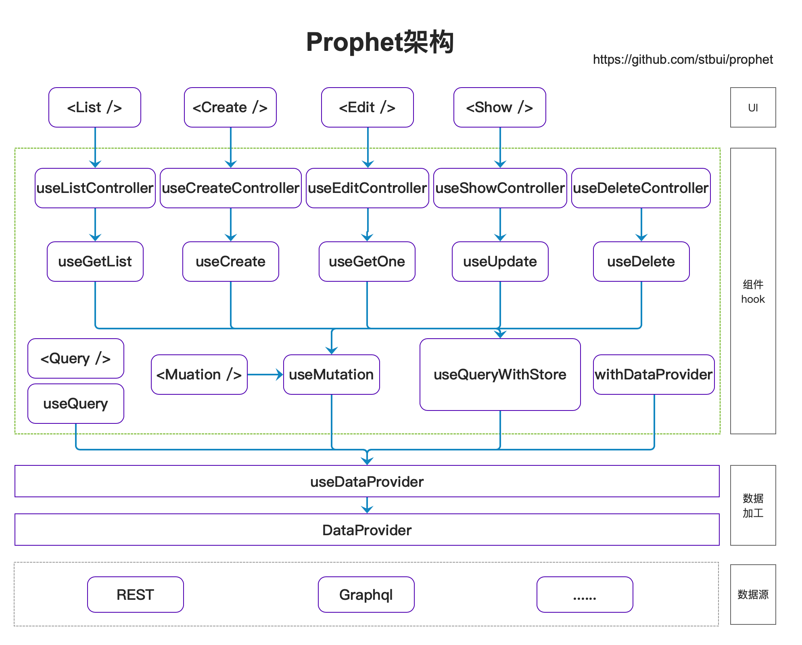

# 先知（Prophet）

[](https://github.com/facebook/react)
[](https://github.com/facebook/react)
[](https://github.com/facebook/react)
[](https://npmcharts.com/compare/@stbui/prophet?minimal=true)
[](https://github.com/stbui/prophet)
[](https://github.com/stbui/prophet)

Prophet 可以快速帮你构建后台管理的中后台前端应用框架，能帮助你使用很少的代码就实现功能完善的后台管理功能。

## 特性

-   高生产效率: 10 分钟内做一个管理后台
-   提炼 CRUD 容器组件，快速开始前端开发
-   提供大量一致的 Hook，处理数据变的简单
-   默认使用 Ant Design 组件布局
-   提炼后台应用的典型页面和场景
-   提供 dataProvider 来处理各种数据规范

# 架构



## 起步

```bash
npm install @stbui/prophet@latest @stbui/prophet-data-json-server@latest
```

```js
import { Prophet, Resource } from '@stbui/prophet';
import dataJsonServer from '@stbui/prophet-data-json-server';

<Prophet dataProvider={dataJsonServer('http://127.0.0.1:3001')}>
    <Resource
        name="users"
        list={props => <div>list</div>}
        edit={props => <div>edit</div>}
        create={props => <div>create</div>}
        show={props => <div>show</div>}
    />
</Prophet>;
```

## Packages

| Package                                                         | Docs | Description       |
| --------------------------------------------------------------- | ---- | ----------------- |
| [`@stbui/prophet-core`](/packages/core)                         |      | 底层组件的封装    |
| [`@stbui/prophet-antd`](/packages/antd)                         |      | antd UI 实现      |
| [`@stbui/prophet-data-json-server`](/packages/data-json-server) |      | REST 接口规范实现 |
