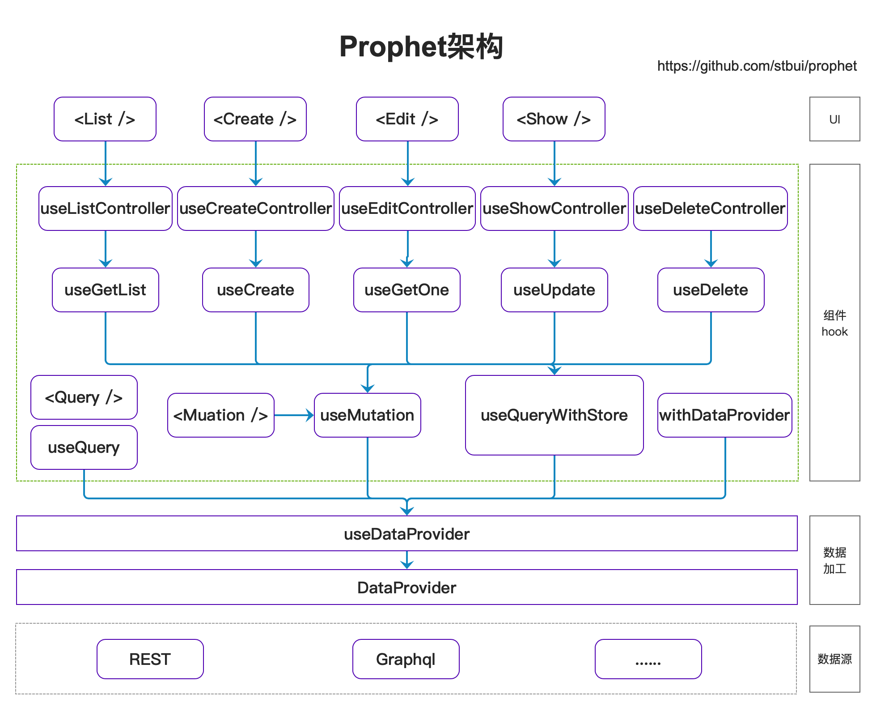

# 中后台前端应用框架（Prophet）

用于构建企业级 react 中后台前端应用框架。基于 redux 和 redux-saga 数据流方案，提取出 CURD 组件,支持各种数据格式的适配。

## 特性

-   提炼 CRUD 容器组件，快速开始前端开发
-   基于 Ant Design 组件布局
-   提炼后台应用的典型页面和场景
-   提供 dataProvider 来适配各种数据规范

## 架构

-   ** 数据源: ** 后端接口提供方式，如 REST，Graphql， RPC 等
-   ** 数据处理: ** 通过数据源提供来的数据进行规范化处理
-   ** 组件/Hook: ** 将数据封装 CRUD 组件和 Hook
-   ** UI: ** 包装成业务组件
